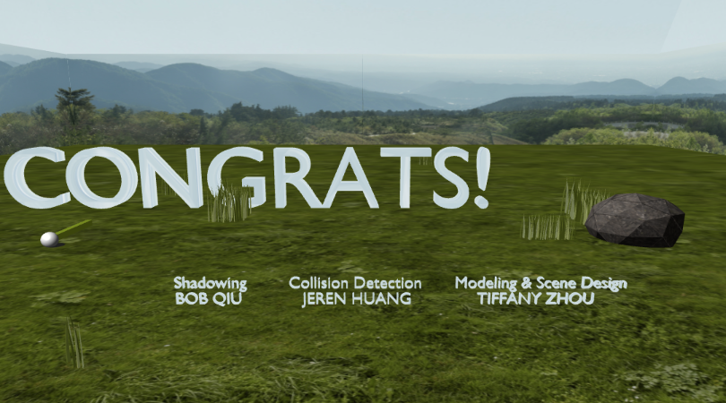

# Team Project: Mini-golf
## Team Members
Bob Qiu (UID: 405-171-645)\
Tiffany Zhou (UID: 705-321-747)\
Jeren Huang (UID: 605-389-002)

## Introduction
Our team implemented a simple game, inspired by real life mini-golf. The main goal of the game is simple: move the ball into a hole in the least number of "hits" by adjusting the direction and strength of each hit. The project uses the tiny-graphics and WebGL libraries, as well as blender for some modeling and animation (details in advanced features section).

## Gameplay
The player can change the direction and power with buttons "Aim counter-clockwise",  "Aim clockwise", "Increase Power" and "Decrease Power". And press "Hit ball" to hit the ball in the desired direction. The project contains three holes and a bonus level with winning message and credits. 
- Level 1 is a regular flat mini-golf course. 
- Level 2 contains an obstacle in front of the hole. The player needs to carefully adjust the angle and possibly win with multiple hits.
- Level 3 contains a one-way ramp. The player needs to increase the power to hit the ball up the ramp.
- Level 4 is the bonus level with a winning message and credits.

When the ball falls through the hole, the next level is automatically displayed. The player can navigate freely to Level 1, 2, 3 by clicking the control buttons, but Level 4 is displayed only when the player completes Level 3.  

The scoreboard tracks the count of hits and allows multiple players to compete.

The background music can be played and paused by clicking the "Music" button. The audio of hitting the ball is automatically played in every hit.

The player can choose from multiple camera views ("Default view", "View course", "View hole", "View scene", and "View ball") to go back to the default view, check the whole course from above, inspect the hole, view the whole scene and follow the ball, respectively.

## Advanced Features

### Physics Simulation and Collision Detection

The project uses the tiny-graphics "body" and "simulation" classes as a template for implementing the physical simulation needed for the game. The simulation uses a simple sphere to rectangular bounding box collision system for intersections between the ball and walls/obstacles. This allows for a simple matrix calculation to determine intersections and  normals to intersection. The simulation also uses a special bounding box for ramps, to emulate "rolling" and the "inertial momentum"  of the ball, while trying to realistically accelerate/decellerate a ball rolling up/down a ramp.

Another important part of physics is the friction forces on the ball. To ensure that the friction always maintained  a linear relation with the ball velocity (for realism), we used a simple exponential function of the difference  in time since the last simulation update. This ensured that the friction/ball behavior remained constant, even if  the browser were to lag.

### Shadowing

Besides collision detection and physics simulation, we also implemented shadowing of the moving golf ball and static shadow of other objects in the scene such as the shadow of the flag pole.  As for the shadow of the golf ball,  we implemented it such that calculates a constant vector from the ball to the ground, and draws a projection of the ball at that location. The shadow effects would be applied After taking these factors into account.

## Modeling and Scene Creation

For precise shapes and textures, the project imports 3D models created with Blender and import them to the game, including three golf courses, fifteen grass models, and a stone. The golf courses contain real holes that the ball can fall through. In each game, grass varies by the shapes and colors randomly, and  the slight movement of grass indicates the presence of mild wind in nature. To apply different real-life textures to the course, we UV-unwrap the course models and bake multiple textures to one image as a whole.

The skybox with landscape is made up of multiple square planes of certain locations and simulates a real-life environment of nature.  

The scoreboard is created with simple HTML code using the canvas example provided by TA on piazza.

## References

Text handling: [https://webglfundamentals.org/webgl/lessons/webgl-text-canvas2d.html](https://webglfundamentals.org/webgl/lessons/webgl-text-canvas2d.html)

Collision Detection Algorithms: [https://developer.mozilla.org/en-US/docs/Games/Techniques/3D_collision_detection](https://developer.mozilla.org/en-US/docs/Games/Techniques/3D_collision_detection)

Unwrap and Bake Textures in Blender 2.8: [https://www.youtube.com/watch?v=c2ut0Trcdi0](https://www.youtube.com/watch?v=c2ut0Trcdi0)

Create 3D Text with Blender: [https://www.youtube.com/watch?v=cS3aRmcohn8](https://www.youtube.com/watch?v=cS3aRmcohn8)

Textures (wood, grass, sky): [https://www.textures.com/library](https://www.textures.com/library)

3D Grass Models: [https://www.cgtrader.com/free-3d-models/grass](https://www.cgtrader.com/free-3d-models/grass)
